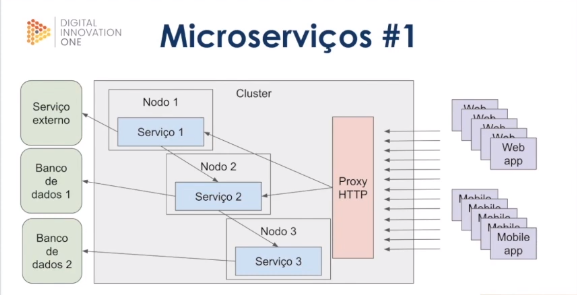
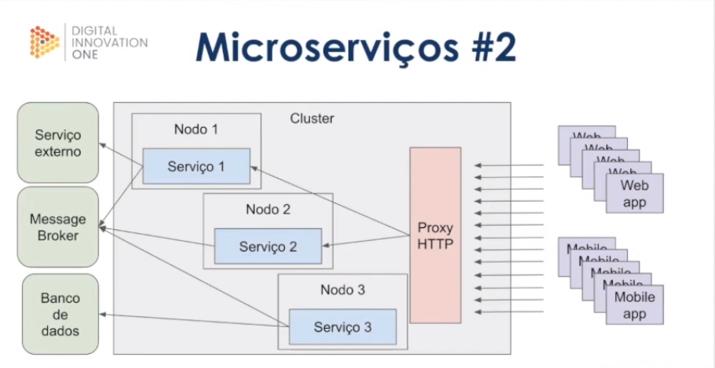
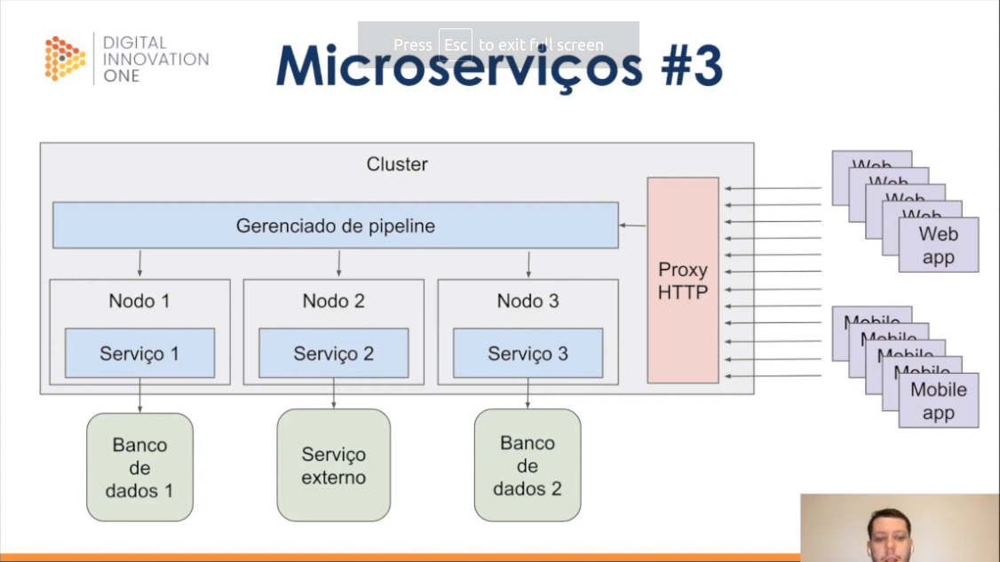

# Resumo Fundamentos de Arquitetura de Sistemas

## Web Services
* São serviços que se comunicam geralmente pelo protocolo http utilizando alguma linguagem de marcação
* Normalmente é usado JSON para arquiteturas do tipo REST, mas também pode ser usado o XML na comunicação.
* Para o protocolo SOAP é utilizado o XML

## Arquitetura SOAP
* SOAP - Simple Object Access Protocol
* Baseado em XML para serviços web, geralmente via via HHTP
* SOAP pode é uma definição de como web services se comunicam e foi desenvolvido para facilitar a integração entre aplicações
* Permite a integração entre aplicações independente de linguagens (com o uso do XML)
* Pode ser usado por outrso protocolos além de HTTP

### XML
* XML - Extensible Markup Language
* Linguagem de marcação criada pela W3C na Década de 90
* Facilita a separação de conteúdo
* Não tem limitação de criação de tags
* Linguagem comum para integração entre aplicações
### Estrutura SOAP
* #### [SOAP ENVELOPE[SOAP HEADER][SOAP BODY]]
* #### SOAP Envelope é o primeiro elemento do documento e encapsula o header e o body
* #### SOAP Header é o elemento que possui informaçãoes de atributos e metadados da requisição
* #### SOAP Body é o elemento que contem a mensagem em sí 

## WSDL
* WSDL = Web Services Description Language
* Contrato de serviços, usado para descrever Web Services
* Feito em XML, onde é descrito o serviço, operações,métodos e especificações de acesso.
  
## XSD
* XSD = XML Schema Definitions
* Um schema no formato xml usado para definir a estrutura de dados que será validada no XML.
* O XSD funciona como uma documentação de como deve ser montado o SOAP Message que será enviado através do Web Service.
## Rest
* REST = Representional State Transfer
* Estilo de arquitetura de implementação de serviços web
* Pode trabalhar com XML ou JSON
* Permite integração entre aplicações e entre cliente e servidor e aplicações
* Faz uso dos métodos HTTP
## API
* API=Application Programming interface
* Conjunto de rodtinas documentados e disponibilizados por uma aplicação, com o intuito de ser consumido por outras aplicações
* FIcou popular com o aumento dos serviços web.
## Métodos HTTP
* GET = Solicita a representação de um recurso
* POST = solicita a criação de um recurso
* PUT = solicita a atualização de um recurso
* DELETE = solicita a exclusão de um recurso.
## Códigos de Estado
* 1xx = Informativo
* 2xx = Sucesso
* 3xx = Redirecionamento
* 4xx = Erro do cliente
* 5xx = Erro do servidor

## Tipos de arquitetura
* ### Monolito:
  * Em engenharia de software, uma aplicação monolítica descreve uma única aplicação de software em camadas no qual a interface de usuário e código de acesso aos dados são combinados em um único programa a partir de uma única plataforma.
    Uma aplicação monolítica é autônoma e independente de outras aplicações de computação. A filosofia do projeto consiste em um aplicativo que não é responsável apenas por uma determinada tarefa, mas que também pode executar todos os passos necessários para completar uma determinada função.
    Um aplicativo monolítico descreve uma aplicação de software que é projetado sem modularidade. A modularidade é desejável, em geral, uma vez que suporta a reutilização de partes da lógica da aplicação e também facilita a manutenção, permitindo o reparo ou substituição de peças da aplicação sem a necessidade de substituição por atacado.
   #### Prós e Contras:
   ##### Prós:
*   Baixa Complexidade
*   Monitoramento Simplificado
   ##### Contras:
*   Stack Única
*   Compartilhamento de recursos
*   Acoplamentos
*   Mais complexo a escalabilidade
* ### Microsserviços:
* #### Microsserviço 1:
* Os serviços estão diretamente acoplados e interagem entre si
  
* ##### Prós:
* Stack dinâmica
* Simples escalabilidade
* ##### Contras:
* Acoplamento
* Monitoramento mais complexo
* Provisionamento mais complexo
* #### Microsserviço 2:
* Serviços se comunicando por meio de message broker, os serviços não conversam entre sí diretamente.
  
* ##### Prós:
* Stack dinâmica
* Simples escalabilidade
* Desacoplamento
* ##### Contras:
* Monitoramento mais complexo
* Provisionamento mais complexo
*  #### Microsserviço 3:
* Microsserviço dependente de gerenciador de pipeline.
  
* ##### Prós:
* Stack dinâmica
* Simples escalabilidade
* Desacoplamento
* Menor Complexidade
* ##### Contras:
* Plataforma dependente do gerenciador de pipeline
* Provisionamento mais complexo
## Gerenciamento de erros e volume de acesso
* #### Onde é mais complexo:
* Processos assíncronos (Microsserviços 2)
* Pipeline
* #### Solução:
* Dead letter queue
* Filas de re-tentativas
* 